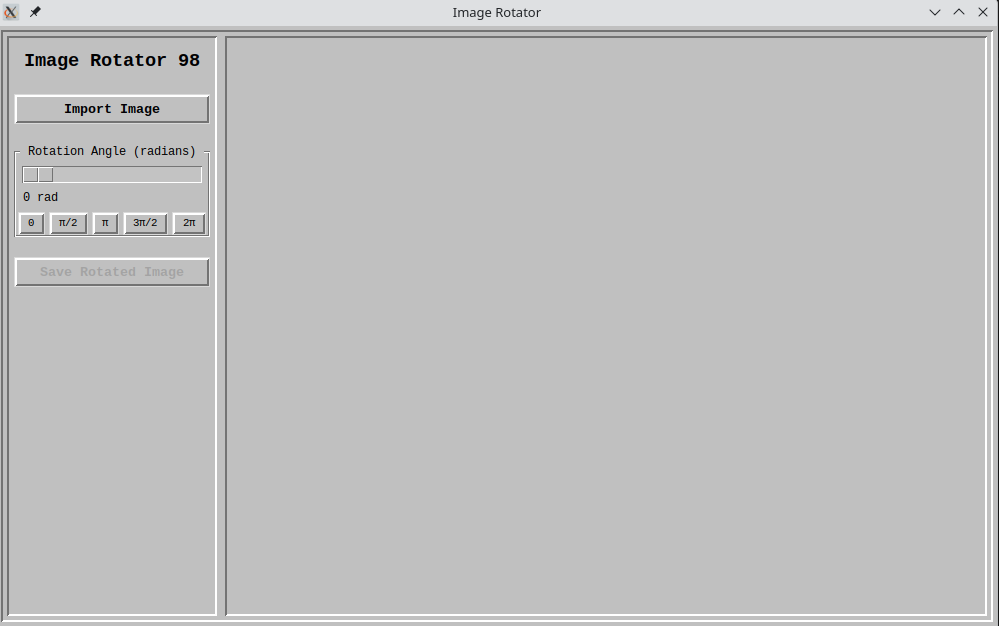

# Image Rotator
An application that rotates images using complex number transformations, also I riped off WIndows 98 style.



## Installation

1. Clone the repository:
   ```
   git clone https://github.com/cdkw2/image_rotation_with_complex_numbers
   cd image_rotation_with_complex_numbers
   ```

2. Install dependencies:
   ```
   pip install -r requirements.txt
   ```

## 🚀 Usage

Run the application:
```
python image_rotator.py
```

- Click "Import Image" to load an image
- Use the slider or quick buttons to set rotation angle
- Click "Save Rotated Image" to export

## 🔮 Future Ideas

+----------[ Under Construction ]--------------------------------+
|                                                                |
|  [ ] Drag-and-drop image loading                               |
|  [ ] Custom rotation center picker                             |
|  [ ] Complex plane overlay (show Z vs Z' positions)            |
|                                                                |
+----------------------------------------------------------------+

## 📜 License
MIT License - Feel free to modify and distribute!